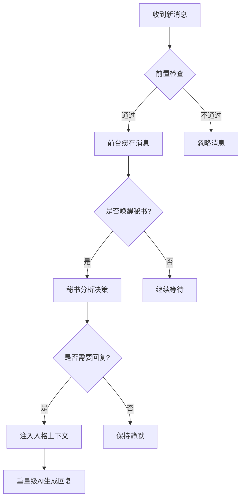

# AngelHeart - 智能群聊交互插件

[](https://opensource.org/licenses/MIT)
[](https://github.com/Soulter/AstrBot)

AngelHeart 是一个专为 [AstrBot](https://github.com/Soulter/AstrBot) 平台设计的智能群聊交互插件。它采用创新的**两级AI协作架构**，实现高质量、低成本的智能对话交互，让AI成为懂分寸、有眼色的聊天伙伴。

## ✨ 核心特性

### 🎯 智能决策机制
- **两级AI协作**：轻量级AI分析对话，重量级AI生成回复
- **智能计时器**：避免抢话，尊重人类对话节奏
- **上下文感知**：基于完整对话历史做出精准判断

### ⚡ 高效架构设计
- **轻量级前端缓存**：实时接收并缓存所有合规消息
- **异步处理**：支持高并发场景下的稳定运行
- **智能去重**：基于时间戳和内容的智能上下文合并

### 🔧 灵活配置
- **白名单机制**：精确控制插件生效范围
- **自定义策略**：支持个性化回复策略指导
- **性能监控**：内置丰富的状态监控和健康检查

## 🏗️ 架构设计

### 核心工作流程



### 两级AI协作体系

1. **轻量级AI（分析员）**
   - 使用快速、低成本模型
   - 分析对话上下文，判断是否需要回复
   - 处理90%以上的静默观察场景

2. **重量级AI（专家）**
   - 仅在必要时激活
   - 使用强大、高成本模型
   - 生成有深度和高质量的回复

## 🚀 快速开始

### 前置要求

- [AstrBot](https://github.com/Soulter/AstrBot) 平台已安装并运行
- Python 3.8+ 环境
- 至少一个可用的AI模型提供商

### 安装步骤

1. **下载插件**
   ```bash
   # 将插件克隆或下载到 AstrBot 的 plugins 目录
   cd /path/to/AstrBot/data/plugins
   git clone https://github.com/your-repo/astrbot_plugin_angel_heart.git
   ```

2. **安装依赖**
   ```bash
   pip install apscheduler
   ```

3. **启用插件**
   - 在 AstrBot 的 WebUI 中启用 `AngelHeart` 插件
   - 重启 AstrBot 服务

### 基础配置

在 AstrBot 的插件配置界面中设置：

- **`analyzer_model`**: 轻量级分析模型提供商名称（推荐使用快速、低成本的模型）
- **`waiting_time`**: 分析间隔时间，默认7秒
- **`whitelist_enabled`**: 是否启用白名单功能
- **`chat_ids`**: 白名单群聊ID列表
- **`reply_strategy_guide`**: 自定义回复策略指导

## ⚙️ 详细配置

### 模型配置

```json
{
  "analyzer_model": "your-fast-model-provider",
  "waiting_time": 7.0,
  "cache_expiry": 3600
}
```

### 白名单配置

```json
{
  "whitelist_enabled": true,
  "chat_ids": ["123456789", "987654321"]
}
```

### 策略指导配置

提供详细的回复策略指导，帮助AI更好地理解何时以及如何回复：

```text
下面的例子是针对不同场景的回复策略建议：

1. 火药味和攻击性强时，决策：缓和气氛，语气温和友善
2. 当出现技术性问题时，决策：技术指导，提供准确解答
3. 当用户寻求帮助时，决策：表示共情之后给出实用建议
4. 当出现误解时，决策：澄清解释，耐心沟通
5. 当出现积极反馈时，决策：鼓励支持，表示认同
```

## 🎮 管理员命令

### 状态查询
```bash
/angelheart
```
查看插件运行状态，包括处理统计和缓存信息。

### 状态重置
```bash
/angelheart_reset
```
重置当前会话的插件状态，清除缓存和计时器。

### 健康检查
```bash
/angelheart_health
```
显示详细的健康检查信息，包括缓存状态和性能指标。

### 配置重载
```bash
/angelheart_reload
```
重新加载插件配置（需要管理员权限）。

## 📊 性能监控

插件内置丰富的监控指标：

- **消息处理统计**: 总处理消息数、分析次数、回复次数
- **缓存状态**: 活跃会话数、缓存消息总数
- **性能指标**: 分析耗时、缓存命中率
- **健康状态**: 最后一次分析时间、缓存过期情况

## 🏗️ 项目结构

```
astrbot_plugin_angel_heart/
├── main.py                    # 插件主入口，消息过滤和计时器调度
├── metadata.yaml              # 插件元数据信息
├── _conf_schema.json          # WebUI配置文件定义
├── README.md                  # 项目文档
├── requirements.txt           # 依赖包列表
├── core/
│   └── llm_analyzer.py        # LLM分析器，实现两级AI协作
└── models/
    └── analysis_result.py     # 分析结果数据模型
```

## 🔧 核心组件

### [`main.py`](main.py:1)
插件主入口，负责：
- 消息接收和前置检查
- 前台缓存管理
- 秘书调度和唤醒
- 管理员命令处理

### [`core/llm_analyzer.py`](core/llm_analyzer.py:1)
LLM分析器核心，实现：
- 对话上下文分析
- JSON格式决策生成
- 智能提示词构建
- 错误处理和重试机制

### [`models/analysis_result.py`](models/analysis_result.py:1)
数据模型定义：
- `SecretaryDecision`: 秘书决策结果模型
- 包含回复判断、策略建议、话题概括

## 📦 依赖管理

核心依赖：
```bash
pip install apscheduler
```

可选依赖（已在requirements.txt中）：
```bash
aiofiles>=23.0.0
aiohttp>=3.11.18
feedparser>=6.0.11
httpx>=0.24.0
```

## 🐛 故障排除

### 常见问题

1. **插件未生效**
   - 检查是否在AstrBot WebUI中启用插件
   - 确认模型提供商配置正确

2. **分析失败**
   - 检查轻量级AI模型是否可用
   - 查看日志中的错误信息

3. **缓存问题**
   - 使用 `/angelheart_reset` 重置状态
   - 检查缓存配置参数

### 日志查看

查看AstrBot日志获取详细调试信息：
```bash
tail -f /path/to/astrbot/logs/app.log
```

## 🤝 贡献指南

欢迎提交Issue和Pull Request来改进这个项目！

1. Fork 本项目
2. 创建特性分支 (`git checkout -b feature/AmazingFeature`)
3. 提交更改 (`git commit -m 'Add some AmazingFeature'`)
4. 推送到分支 (`git push origin feature/AmazingFeature`)
5. 开启Pull Request

## 📄 许可证

本项目采用 MIT 许可证 - 查看 [LICENSE](LICENSE) 文件了解详情。

## 🙏 致谢

- 感谢 [AstrBot](https://github.com/Soulter/AstrBot) 提供的优秀平台
- 感谢所有贡献者和用户的支持

---

**AngelHeart** - 让AI对话更智能、更自然、更有分寸感 💖