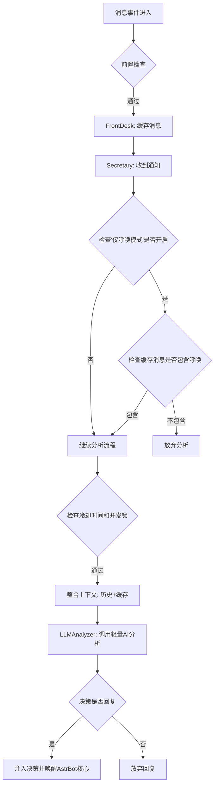

# AngelHeart - 智能群聊交互插件

[](https://opensource.org/licenses/MIT)
[](https://github.com/Soulter/AstrBot)

AngelHeart 是一个专为 [AstrBot](https://github.com/Soulter/AstrBot) 平台设计的智能群聊交互插件。它采用创新的**两级AI协作架构**，实现高质量、低成本的智能对话交互，让AI成为懂分寸、有眼色的聊天伙伴。

## ✨ 核心特性

### 🎯 智能决策机制
- **两级AI协作**：轻量级AI分析对话，重量级AI生成回复。
- **两级AI协作**：轻量级AI根据对话调整重量AI的提示词，让重量级AI灵活多变。
- **智能计时器**：避免抢话，尊重人类对话节奏。
- **上下文感知**：基于完整对话历史做出精准判断。
- **可配置的激活模式**: 支持“持续分析”和“仅呼唤时分析”两种模式。

### ⚡ 高效架构设计
- **轻量级前端缓存**：实时接收并缓存所有合规消息。
- **异步处理**：支持高并发场景下的稳定运行。
- **智能去重**：基于时间戳和内容的智能上下文合并。

### 🔧 灵活配置
- **中心化配置管理**：通过 `ConfigManager` 统一管理所有配置项。
- **白名单机制**：精确控制插件生效范围。
- **自定义策略**：支持个性化回复策略指导。

## 🏗️ 架构设计

### 核心工作流程



### 两级AI协作体系

1. **轻量级AI（分析员）**
   - 使用快速、低成本模型
   - 分析对话上下文，判断是否需要回复
   - 处理90%以上的静默观察场景

2. **重量级AI（专家）**
   - 仅在必要时激活
   - 使用强大、高成本模型
   - 生成有深度和高质量的回复

## 🚀 快速开始

### 前置要求

- [AstrBot](https://github.com/Soulter/AstrBot) 平台已安装并运行
- Python 3.8+ 环境
- 至少一个可用的AI模型提供商

### 安装步骤

1. **下载插件**
   ```bash
   # 将插件克隆或下载到 AstrBot 的 plugins 目录
   cd /path/to/AstrBot/data/plugins
   git clone https://github.com/your-repo/astrbot_plugin_angel_heart.git
   ```

2. **安装依赖**
   ```bash
   pip install apscheduler
   ```

3. **启用插件**
   - 在 AstrBot 的 WebUI 中启用 `AngelHeart` 插件
   - 重启 AstrBot 服务

### 基础配置

在 AstrBot 的插件配置界面中设置：

- **`analyzer_model`**: 轻量级分析模型提供商名称（推荐使用快速、低成本的模型）。
- **`alias`**: 为AI助手设置一个全局别名，用于“呼唤模式”和提示词。
- **`waiting_time`**: 两次主动分析之间的最小冷却时间（秒）。
- **`analysis_on_mention_only`**: **[新]** 是否仅在消息中包含人格名称或别名时才进行分析。
- **`whitelist_enabled`**: 是否启用白名单功能。
- **`chat_ids`**: 白名单群聊ID列表。
- **`reply_strategy_guide`**: 自定义回复策略指导。

## ⚙️ 详细配置说明

| 配置项 | 类型 | 描述 | 默认值 |
| --- | --- | --- | --- |
| `analyzer_model` | string | 用于分析对话的轻量级、快速的LLM模型提供商名称。 | `""` |
| `alias` | string | 为AI助手设置一个全局别名，用于“呼唤模式”和提示词。 | `AngelHeart`|
| `waiting_time` | float | 两次主动分析之间的最小冷却时间（秒）。 | `7.0` |
| `analysis_on_mention_only` | bool | 是否仅在消息中包含人格名称或别名时才进行分析。 | `false` |
| `whitelist_enabled` | bool | 是否启用群聊/私聊白名单。 | `false` |
| `chat_ids` | list | 白名单列表，填入允许插件生效的群聊或好友的QQ号。 | `[]` |
| `cache_expiry` | int | 前台消息缓存的过期时间（秒）。 | `3600` |
| `reply_strategy_guide` | string | 指导轻量级模型如何判断回复策略的文本。 | (内置默认值) |
| `debug_mode` | bool | 调试模式。启用后，分析器建议回复时仅记录日志，不会实际触发回复。 | `false` |
| `prompt_logging_enabled` | bool | 提示词日志增强。启用后，会完整记录发送给分析模型的提示词。 | `false` |

## 💡 使用建议

1.  **初次使用**: 建议保持 `analysis_on_mention_only` 为 `false`，观察插件在群聊中的表现。
2.  **减少打扰**: 如果您觉得插件过于活跃，可以将 `analysis_on_mention_only` 设置为 `true`，这样只有在大家明确需要它时它才会出现。
3.  **性能与成本**: `analyzer_model` 建议选择一个响应速度快、成本较低的模型，例如 `qwen-turbo`、`glm-3-turbo` 等，以实现最佳的性价比。
4.  **提示词艺术**: 大模型的提示词不要给太多规则，这样会让大模型显得僵硬，让小模型指导大模型当前需要做的事情，大模型回答才会更精准。
5.  **建议禁用上游设置**：禁用一切唤醒词，禁用一切@，指令等一系列会越过本插件的功能
6.  **建议的模型**：小模型推荐gemini2.5-flash-lite,如果需要高并发推荐gemma27B，如果一天可能超过上万次推荐本地部署qwencode30B/80B。大模型首推deepseek。

## 🏗️ 项目结构

```
astrbot_plugin_angel_heart/
├── main.py                    # 插件主入口，消息过滤和计时器调度
├── metadata.yaml              # 插件元数据信息
├── _conf_schema.json          # WebUI配置文件定义
├── README.md                  # 项目文档
├── requirements.txt           # 依赖包列表
├── core/
│   ├── llm_analyzer.py        # LLM分析器，实现两级AI协作
│   ├── config_manager.py      # 配置管理器，提供中心化配置访问
│   └── utils.py               # 共享工具函数
├── models/
│   └── analysis_result.py     # 分析结果数据模型
├── prompts/
│   └── secretary_analyzer.md  # 秘书分析员的Prompt模板
└── roles/
    ├── __init__.py            # 角色模块初始化
    ├── secretary.py           # 秘书角色，负责智能分析与决策
    └── front_desk.py          # 前台角色，负责消息接收与缓存
```

## 🔧 核心组件

### [`main.py`](main.py:1)
插件主入口，负责：
- 消息接收和前置检查
- 前台缓存管理
- 秘书调度和唤醒
- 配置管理器初始化

### [`core/llm_analyzer.py`](core/llm_analyzer.py:1)
LLM分析器核心，实现：
- 对话上下文分析
- JSON格式决策生成
- 智能提示词构建
- 错误处理和重试机制

### [`core/config_manager.py`](core/config_manager.py:1)
配置管理器，提供：
- 中心化配置项访问
- 配置项默认值管理
- 类型安全的配置获取
- 配置热重载支持

### [`core/utils.py`](core/utils.py:1)
工具函数库，提供：
- 共享的、独立的辅助函数，例如时间戳处理

### [`models/analysis_result.py`](models/analysis_result.py:1)
数据模型定义：
- `SecretaryDecision`: 秘书决策结果模型
- 包含回复判断、策略建议、话题概括

### [`roles/secretary.py`](roles/secretary.py:1)
秘书角色核心，负责：
- 基于配置的智能分析间隔进行决策
- 调用 LLM 分析器处理上下文
- 生成是否需要回复的决策

### [`roles/front_desk.py`](roles/front_desk.py:1)
前台角色核心，负责：
- 接收并缓存所有合规消息
- 管理消息缓存的生命周期
- 在适当时机通知秘书进行处理

## 📦 依赖管理

核心依赖：
```bash
pip install apscheduler
```

可选依赖（已在requirements.txt中）：
```bash
aiofiles>=23.0.0
aiohttp>=3.11.18
feedparser>=6.0.11
httpx>=0.24.0
```

## 🐛 故障排除

### 常见问题

1. **插件未生效**
   - 检查是否在AstrBot WebUI中启用插件
   - 确认模型提供商配置正确

2. **分析失败**
   - 检查轻量级AI模型是否可用
   - 查看日志中的错误信息

3. **缓存问题**
   - 检查缓存配置参数

### 日志查看

查看AstrBot日志获取详细调试信息：
```bash
tail -f /path/to/astrbot/logs/app.log
```

## 🤝 贡献指南

欢迎提交Issue和Pull Request来改进这个项目！

1. Fork 本项目
2. 创建特性分支 (`git checkout -b feature/AmazingFeature`)
3. 提交更改 (`git commit -m 'Add some AmazingFeature'`)
4. 推送到分支 (`git push origin feature/AmazingFeature`)
5. 开启Pull Request

## 📄 许可证

本项目采用 MIT 许可证 - 查看 [LICENSE](LICENSE) 文件了解详情。

## 🙏 致谢

- 感谢 [AstrBot](https://github.com/Soulter/AstrBot) 提供的优秀平台
- 感谢所有贡献者和用户的支持

---

**AngelHeart** - 让AI对话更智能、更自然、更有分寸感 💖