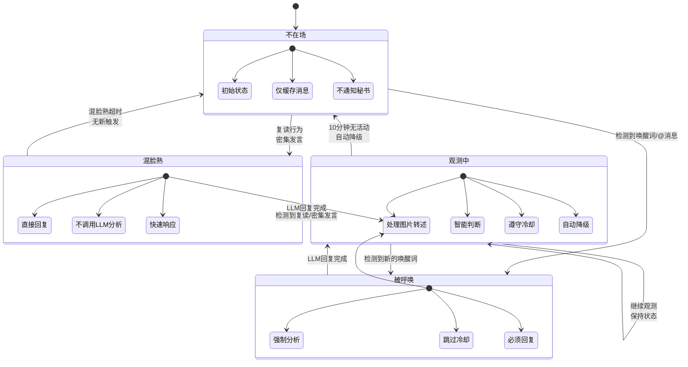
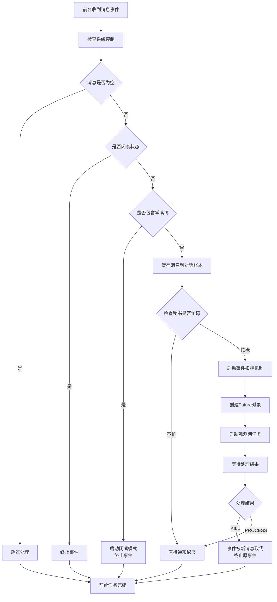

# AngelHeart 插件业务流程设计

## 一、秘书的完整流程图

```mermaid
graph TD
    A[秘书接收前台通知] --> B{获取当前状态}

    B -->|不在场| C[异常情况<br/>前台不应该通知]
    B -->|混脸熟| D[不需要思考的决策]
    B -->|被呼唤| E[需要思考的决策-强制]
    B -->|观测中| F[需要思考的决策-判断]

    %% 混脸熟处理流程
    D --> D1[获取触发类型<br/>复读/密集发言]
    D1 --> D2[调用fishing_reply<br/>生成回复策略]
    D2 --> D3[创建决策对象<br/>should_reply=true]
    D3 --> H[决定回复流程]

    %% 被呼唤处理流程
    E --> E1[跳过冷却时间检查]
    E1 --> E2[调用LLM分析]
    E2 --> E3[生成决策对象]
    E3 --> E4[强制设置should_reply=true]
    E4 --> H[决定回复流程]

    %% 观测中处理流程
    F --> F1[检查冷却时间]
    F1 -->|在冷却期| F2[跳过处理]
    F1 -->|已过冷却期| F3[调用LLM分析]
    F3 --> F4[获取LLM判断结果]
    F4 --> F5{should_reply?}
    F5 -->|是| F6{触发原因}
    F6 -->|被追问(is_questioned)| F7[设置策略: 回应追问]
    F6 -->|话题有趣(is_interesting)| F8[设置策略: 参与话题]
    F7 --> H[决定回复流程]
    F8 --> H
    F5 -->|否| I[决定不回复流程]
    F2 --> I

    %% 共用流程 - 决定回复
    H --> H1[处理图片转述]
    H1 --> H2[存储决策到缓存]
    H2 --> H3[启动耐心计时器]
    H3 --> H4[标记对话为已处理]
    H4 --> H5[注入上下文到事件]
    H5 --> H6[唤醒主脑<br/>event.is_at_or_wake_command=true]
    H6 --> H7[LLM生成回复]
    H7 --> H8[状态转换: 观测中]

    %% 决定不回复流程
    I --> I1[清理决策缓存]
    I1 --> I2[标记对话为已处理]
    I2 --> I3[释放处理锁]

```

## 二、AI 状态转换图



## 三、前台（FrontDesk）流程图



## 四、关键设计说明

### 1. 决策类型分类

- **不需要思考的决策（混脸熟）**：
  - 触发：复读行为、密集发言
  - 特点：快速响应，不调用 LLM 分析
  - 处理：直接使用 fishing_reply 生成简单回复

- **需要思考的决策（被呼唤/观测中）**：
  - 触发：唤醒词、被追问、有趣话题
  - 特点：智能分析，调用 LLM
  - 处理：深度分析上下文后生成回复
  - LLM 返回：
    - should_reply: 是否需要回复
    - is_questioned: 是否被追问
    - is_interesting: 是否话题有趣
    - 代码根据这些字段执行不同策略

### 2. 共用流程设计

决定回复后的所有步骤都是共用的：

- 处理图片转述

- 存储决策

- 启动计时器

- 标记已处理

- 注入上下文

- 唤醒主脑

- 状态转换

### 3. 状态转换规则

- **不在场**：初始状态，仅缓存消息

- **混脸熟**：简单互动，快速回复

- **被呼唤**：用户明确呼唤，必须响应

- **观测中**：智能观察，选择性参与

### 4. 扣押机制

- 前台负责管理扣押

- 秘书忙碌时新消息进入扣押队列

- 扣押期间状态保持不变

- 确保消息处理的有序性

### 5. 冷却时间

- 仅在观测中状态生效

- 被呼唤状态跳过冷却限制

- 防止过度回复，保持对话自然

## 五、异常处理

1. **分析失败**：返回安全状态，释放资源

2. **锁超时**：自动释放，避免死锁

3. **状态异常**：重置为不在场状态

4. **扣押超时**：自动处理或丢弃

## 六、性能优化

1. **缓存机制**：状态判断结果缓存

2. **批量处理**：消息频率统计优化

3. **资源清理**：定期清理过期数据

4. **并发控制**：使用锁保证线程安全
