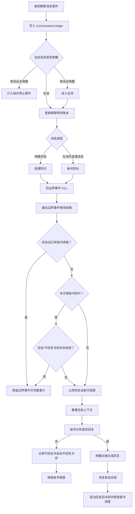

# AngelHeart 当前业务流程

本文只描述当前运行路径。群聊的状态机与调度细节以 [群聊双防抖与状态机](architecture/group_dual_debounce_state_machine.md) 为准。

## 一、参与模型

### 私聊

- 私聊消息写入 `ConversationLedger`。
- 私聊不经过秘书、不使用群聊防抖，也没有离场/在场状态。
- 请求由 AstrBot 主框架直接处理或排队；后到消息不能注入已经运行的子代理。

### 群聊

群聊只有两态：

- **离场（`NOT_PRESENT`）**：普通消息只入账。复读、跟风、密集发言都不会触发进场。
- **在场（`OBSERVATION`）**：只有被 @ 或命中唤醒词后才进入；在场超时后，收到下一条消息时回到离场。

`SUMMONED` 与 `GETTING_FAMILIAR` 仅是旧路径兼容枚举，不属于当前业务状态。不存在“混脸熟回复”路径。

## 二、群聊主流程

```mermaid
flowchart TD
    A[收到群聊消息事件] --> B[写入 ConversationLedger]
    B --> C{当前消息是否唤醒}
    C -->|离场且未唤醒| D[只入账并停止事件]
    C -->|离场且唤醒| E[进入在场]
    C -->|在场| F[更新群聊等待账本]
    E --> F
    F --> G{消息类型}
    G -->|唤醒消息| H[助理防抖]
    G -->|在场的普通消息| I[秘书防抖]
    H --> J[旧边界事件 KILL]
    I --> J
    J --> K[最后边界事件等待到期]
    K --> L{同会话已有秘书调度？}
    L -->|是| M[保留边界事件并完整重计]
    L -->|否| N{本次是秘书防抖？}
    N -->|是| O{回复/不回复冷却尚未结束？}
    O -->|是| M
    O -->|否| P[占用同会话秘书调度]
    N -->|否| P
    P --> Q[重建当前上下文]
    Q --> R[秘书分析是否回复]
    R -->|否| S[记录不回复并启动不回复冷却]
    R -->|是| T[唤醒主脑生成回复]
    S --> U[释放秘书调度]
    T --> V[消息发送完成]
    V --> W[启动回复后冷却并释放秘书调度]
```

## 三、双防抖与单飞

- **助理防抖**：按 `(chat_id, sender_id)` 管理。有人叫到助理时等待补充消息；同一人继续说话会更新边界，新的唤醒会加速等待。
- **秘书防抖**：按 `chat_id` 管理。在场的普通消息暂时安静后，才进入秘书分析。
- **最后边界**：新消息替换等待中的旧事件；只有最后一条边界事件能够放行。
- **同会话单飞**：从秘书分析开始，直到发送成功、不回复或异常收口，同一 `chat_id` 最多运行一轮秘书调度。
- **冷却重计**：回复后冷却或不回复冷却尚未结束时，秘书防抖即使到期也不得放行；保留最后边界事件，从阻断时刻完整重计一轮。

## 四、秘书与主脑的职责

1. 秘书读取激活时重建的上下文，由轻量模型产出 `SecretaryDecision`。
2. `should_reply=False`：停止本事件，记录不回复，并开始 `no_reply_cooldown`。
3. `should_reply=True`：把本事件交给 AstrBot 主脑；正式上下文来自 `ConversationLedger`，工作账本只作为临时提醒。
4. 主脑发送成功后，完成点记录完整 assistant/tool 链，进入在场，并开始 `waiting_time`。

## 五、异常与离场

- 闭嘴或掌嘴：清除该会话的全部等待事件，旧事件全部 KILL。
- 在场超时：转为离场并清除等待事件。
- 防抖计时或秘书处理异常：停止对应事件并释放同会话秘书调度。
- 复读、跟风、密集发言：离场时只入账；不作为自动进场或直接回复条件。

## 六、关键文件

- [`roles/front_desk.py`](../roles/front_desk.py)：消息入账、群聊分流、激活与秘书收口。
- [`core/debounce_manager.py`](../core/debounce_manager.py)：双防抖、边界事件替换、冷却重计与同会话单飞。
- [`roles/secretary.py`](../roles/secretary.py)：轻量模型决策。
- [`core/angel_heart_status.py`](../core/angel_heart_status.py)：离场/在场状态语义与唤醒判定。
- [`core/conversation_ledger.py`](../core/conversation_ledger.py)：正式会话历史。
